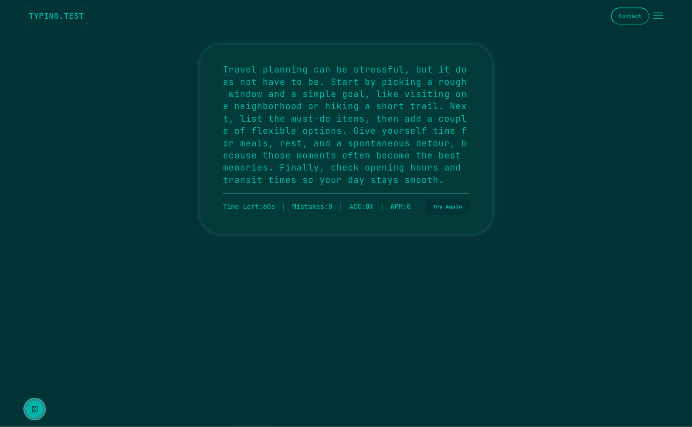
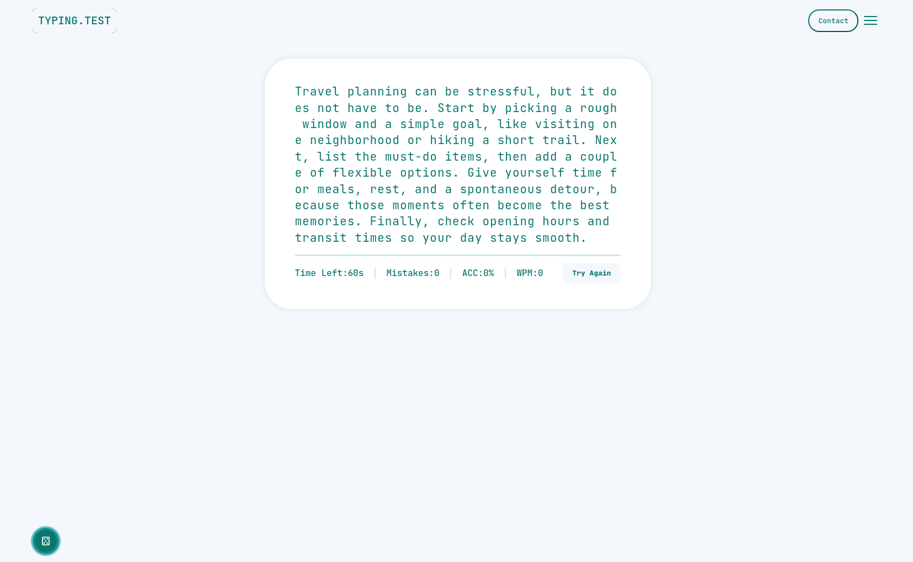
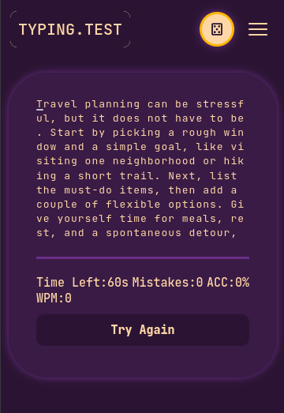
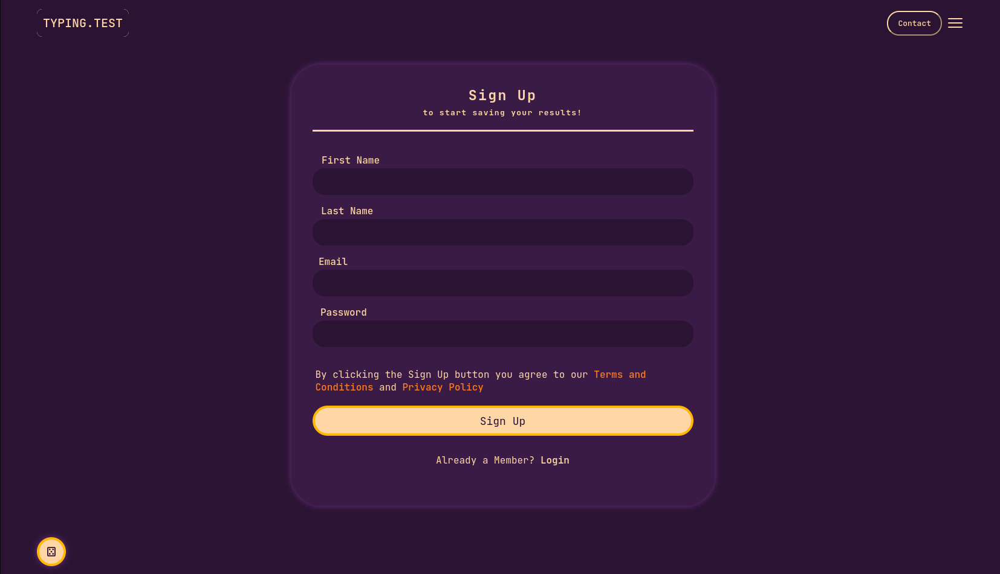

# Typing Test

## Description 
Interactive MERN stack single-page application for practicing typing speed and accuracy.

[Typing Test on GitHub Pages](https://shinyuta.github.io/typing-test-react/)

## Table of Contents

* [Installation](#installation)
* [Running locally](#running-locally)
* [Deployment (GitHub Pages)](#deployment-github-pages)
* [Contributors](#contributors)

## Highlights

- Timed typing test with live accuracy, mistakes, and WPM
- Random paragraph selection from a local list
- Theme randomizer button (dice icon) that updates site colors globally
- Responsive navigation (hamburger on small screens) and a mock Contact page

## Screenshots

### Dark theme


### Theme randomizer (light theme)


### Mobile navigation (hamburger)


### Login page


## Installation 
From the project root:

```bash
npm run install
```

## Running locally
```bash
npm run develop
```

## Deployment (GitHub Pages)

This app is deployed as a static Vite build

## Contributors

- [Yuta (shinyuta)](https://github.com/shinyuta)
- [Walter (Boilermaker74)](https://github.com/Boilermaker74)
- [M (bloodymajima)](https://github.com/bloodymajima)
